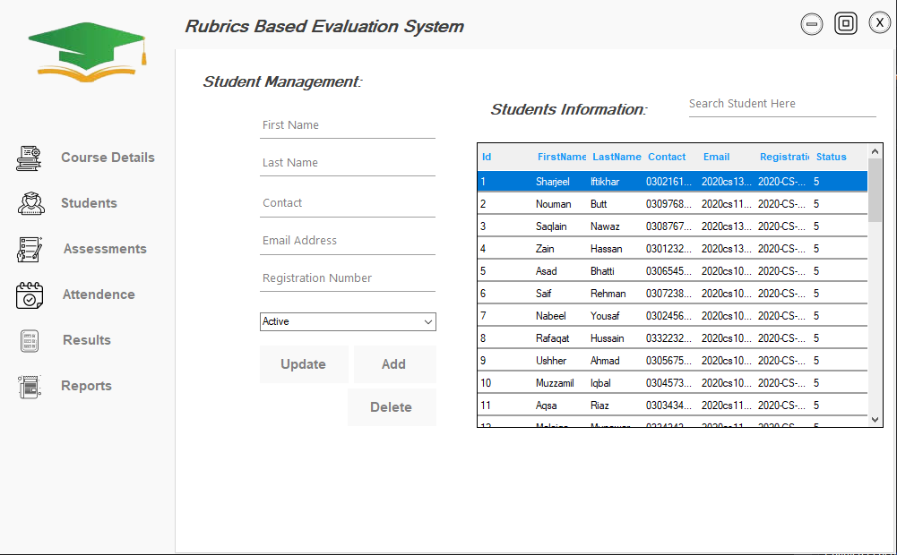

<h1 align="center">Rubrics Based Evaluation System (Database)</h1>
<a href="#">
  <div align="center">
    
    <h2>This is the main screen of the program.</h2>
  </div>
</a> 


# What is in this Project
- Managing Students, CLO's, Rubrics, Rubrics Level, Assessments of a specific course!
- Manage Attendance of the students
- Uses local **database** to store and retrieve data and perform functions.
- Generates different kinds of pdf reports using **ITextSharp**

## Tools & Requirement
- Visual Studio 2017
- .NET Framework 4.6.1
- Microsoft SQL Server Management Studio 18

# Installation

Goto cmd/command line in your computer and type
```
git clone https://github.com/Nouman0x45/Rubric-Based-Evaluation-System
```
- Open the DatabaseScript folder and load script in **Microsoft SQL Server Management Studio**
- Make connection of your database with the project if u dont know how search it on youtube 😅.
- Change the following string and then open project folder and then in configuration file put the command in connectionStr.
```
@"Data Source=Server Name;Initial Catalog=Database Name;Integrated Security=True;MultipleActiveResultSets=true"
```
- Run the project

## Author:
#### Muhammad Nouman Butt
You can get in touch with me on my LinkedIn Profile:

[ Muhammad Nouman Butt](https://www.linkedin.com/in/nouman0x45/)

[ Muhammad Nouman Butt](https://github.com/Nouman0x45)

If you liked the repo then kindly support it by giving it a star ⭐!

If you find any bug in the code or have any improvements in mind then feel free to generate a pull request.

If you face any issue, you can create a new issue in the Issues Tab and I will be glad to help you out.
